# Informe Tarea N°4
**Integrantes:**

Christian Bonifaz, Mateo Calderon, Josue Camacho, Luis Guevara

**NRC:** 5415

**Docente:** Ing. Darwin Alulema

**Tema:** Capitulo 7 (Circuitos en serie-paralelo) y capitulo 8 (Métodos de análisis) de Análisis de Circuitos - Robbins, Miller

### 1. OBJETIVOS

- Clarificar el estudio de circuitos en serie-paralelo, de la misma forma los distintos métodos de analisis todo esto aplicando los conocimientos aprendidos durante clases.

### 2. MARCO TEÓRICO

#### Capitulo 7 (Circuitos en serie-paralelo)

#### Capitulo 8 (Métodos de análisis)

### 3. EXPLICACIÓN Y RESOLUCIÓN DE EJERCICIOS O PROBLEMAS

#### Capitulo 7 (Circuitos en serie-paralelo)

#### Capitulo 8 (Métodos de análisis)

***28. Utilice el análisis de malla para encontrar las corrientes de lazo en el circuito de la figura 8-83. Use sus resultados para determinar I2 y Vab.***

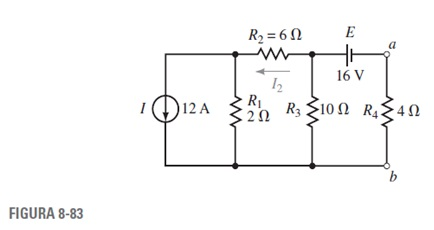

Redibujamos el circuito:

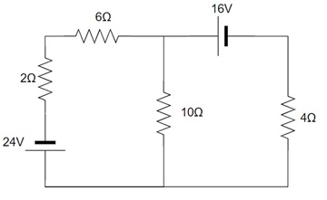

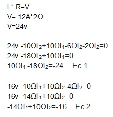

Sistema de ecuaciones entre 1 y 2

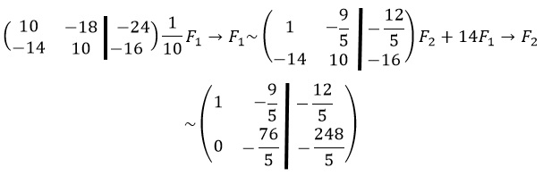

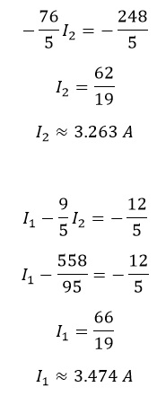

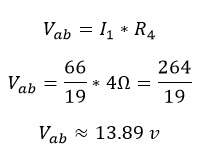

***29. Utilice el análisis de malla para encontrar las corrientes de lazo en el circuito de la figura 8-84. Use sus resultados para determinar I y Vab.***

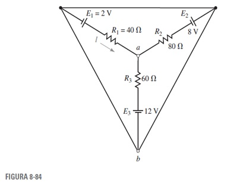

Redibujamos el circuito:

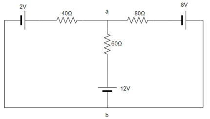

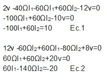

Sistema de ecuaciones entre 1 y 2

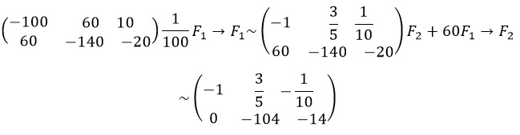

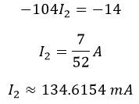

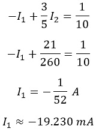

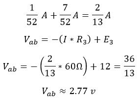

***30. Utilice el análisis de malla para determinar la corriente a través del resistor de n6  en el circuito de la figura 8-85.***

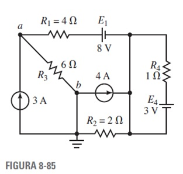

Redibujamos el circuito:

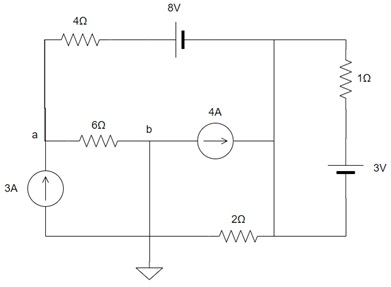

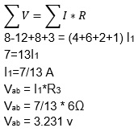

***31. Escriba las ecuaciones de malla para la red de la figura 8-86. Encuentre las corrientes de lazo con determinantes.***

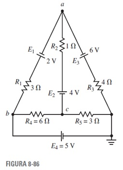

Redibujamos el circuito:

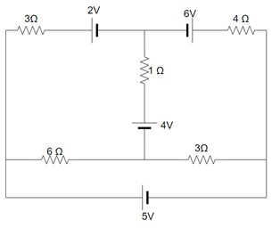

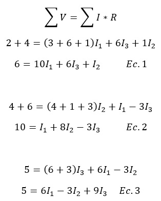

Sistema de ecuaciones de 1,2 y 3:

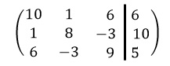

Resolviendo por determinantes:

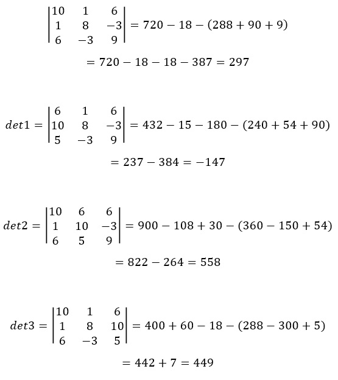

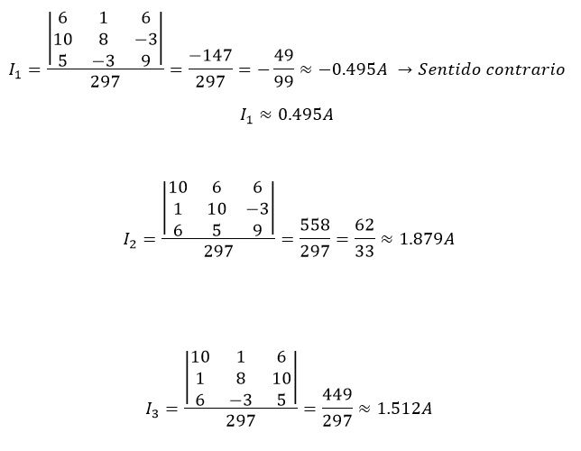

***32. Repita el problema 31 para la red de la figura 8-87.***

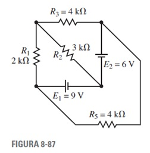

Redibujamos el circuito:

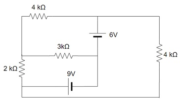

***33. Escriba las ecuaciones de nodos para el circuito de la figura 8-88 y encuentre los voltajes en los nodos.***

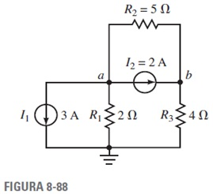

***34. Escriba las ecuaciones de nodos para el circuito de la figura 8-89 y determine el voltaje Vab.***

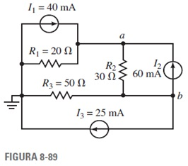

***35. Repita el problema 33 para el circuito de la figura 8-90.***

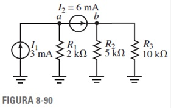

***36. Repita el problema 34 para el circuito de la figura 8-91.***

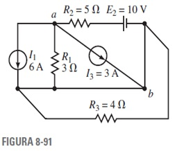

Redibujamos el circuito:

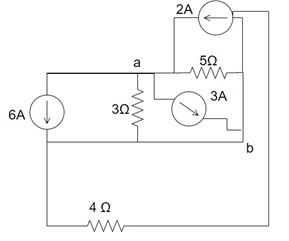

***37. Escriba las ecuaciones de nodos para el circuito de la figura 8-86 y encuentre V6Ω.***

***38. Escriba las ecuaciones de nodos para el circuito de la figura 8-85 y encuentre V6Ω.***

Redibujamos el circuito:

***39. Convierta cada una de las redes de la figura 8-92 en su configuración Y equivalente.***

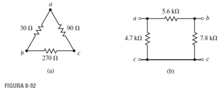

***40. Convierta cada una de las redes de la figura 8-93 en su configuración Y equivalente.***

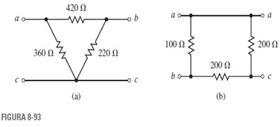

***41. Convierta cada una de las redes Y de la figura 8-94 en su configuración ⧍ equivalente.***

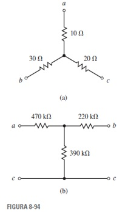

***42. Convierta cada una de las redes Y de la figura 8-95 en su configuración ⧍ equivalente.***

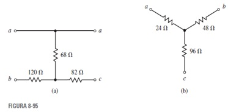

***43. Utilice las conversiones⧍-Y o Y-⧍, para encontrar la corriente I para el circuito de la figura 8-96.***

***44. Utilice las conversiones⧍-Y o Y-⧍, para encontrar la corriente I para el circuito de la figura 8-97.***

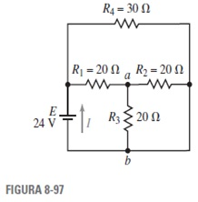

***45. Repita el problema 43 para el circuito de la figura 8-98.***

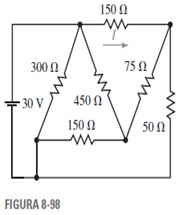

***46.Repita el problema 43 para el circuito de la figura 8-99.***

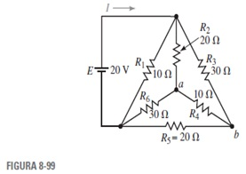

***47.Vea el circuito puente de la figura 8-100:***

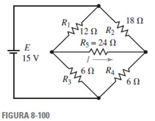

***a. ¿El puente está balanceado? Explique.***

***b. Escriba las ecuaciones de malla.***

***c. Calcule la corriente a través de R5.***

***d. Determine el voltaje en R5.***

***48. Considere el circuito puente de la figura 8-101:***

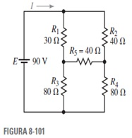

***a. ¿El puente está balanceado? Explique.***

***b. Escriba las ecuaciones de mallas.***

***c. Calcule la corriente a través de R5.***

***d. Determine el voltaje en R5.***

***49.En el circuito puente de la figura 8-102 encuentre la corriente a través de cada resistor.***

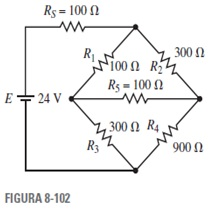

***50. Vea el circuito puente de la figura 8-103:***

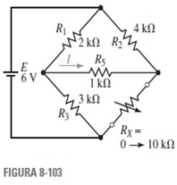

***a. Determine el valor de la resistencia Rx cuando el puente está balanceado.***

***b.Calcule la corriente a través de R5 cuando Rx=0Ω  y cuando Rx=10 kΩ.***

***51. Utilice Multisim para encontrar las corrientes a través de todos los resistores del circuito que se muestra en la figura 8-86.*** 

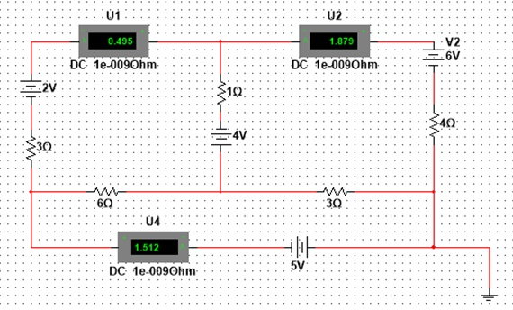

***52. Utilice Multisim para encontrar el voltaje en un resistor de 5 kΩ en el circuito de la figura 8-87.***

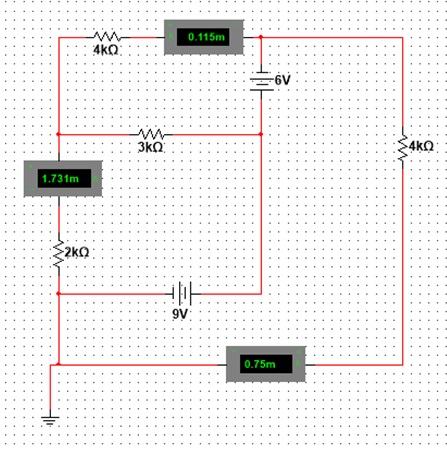

***53. Utilice PSpice para encontrar las corrientes a través de todos los resistores del circuito de la figura 8-96.***

***54. Utilice PSpice para encontrar las corrientes a través de todos los resistores del circuito de la figura 8-97.***

### 4. VIDEO

### 5. CONCLUSIONES 

### 6. BIBLIOGRAFÍA

Robbins, A., & Miller, W. (2008). Análisis de circuitos. Estados Unidos: Cengage Learning.
