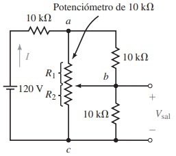
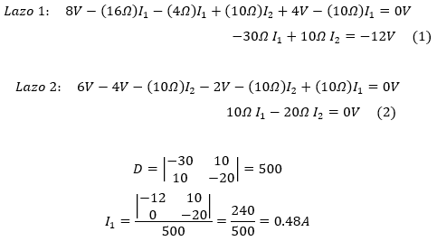
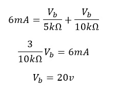
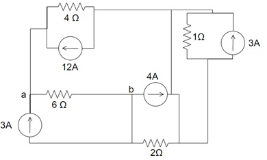
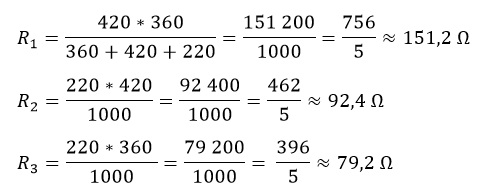
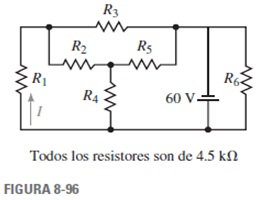
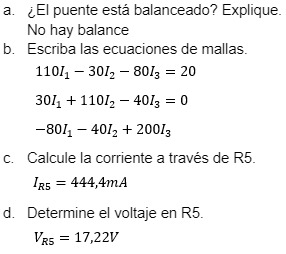

# Informe Tarea N°4
**Integrantes:**

Christian Bonifaz, Mateo Calderon, Josue Camacho, Luis Guevara

**NRC:** 5415

**Docente:** Ing. Darwin Alulema

**Tema:** Capitulo 7 (Circuitos en serie-paralelo) y capitulo 8 (Métodos de análisis) de Análisis de Circuitos - Robbins, Miller

### 1. OBJETIVOS

- Clarificar el estudio de circuitos en serie-paralelo, de la misma forma los distintos métodos de analisis todo esto aplicando los conocimientos aprendidos durante clases.

### 2. MARCO TEÓRICO

#### Capitulo 7 (Circuitos en serie-paralelo)

#### Capitulo 8 (Métodos de análisis)

### 3. EXPLICACIÓN Y RESOLUCIÓN DE EJERCICIOS O PROBLEMAS

#### Capitulo 7 (Circuitos en serie-paralelo)

***21. En el circuito de la figura 7-64 determine VB, IC y VCE.***

***23. Considere el circuito de la figura 7-65 y los valores indicados:***

***a. Determine ID.***

***b. Calcule el valor requerido de RS.*** 

***c. Encuentre VDS.***

***25. Calcule IC y VCE para el circuito de la figura 7-67.***

***27. Vea el circuito de la figura 7-69:***

***a. Determine el intervalo de voltajes que aparecerán en RL a medida que el potenciómetro varíe entre sus valores mínimo y máximo.***

 ***b. Si R2 se ajusta para tener 2.5 k ¿cuál será el voltaje VL? Si se remueve el resistor de carga ¿qué voltaje aparecerá entre las terminales a y b?***
 
 ***29.  Si el potenciómetro de la figura 7-70 se ajusta para que R2 200, determine los voltajes Vab y Vbc.***
 
 
 
***31. Vea el circuito de la figura 7-71:***

***a. Determine el intervalo del voltaje de salida (del mínimo al máximo) que se espera cuando el potenciómetro se ajusta del mínimo al máximo.***

***b. Calcule R2 cuando Vsal=20 V.***

***33. En el circuito de la figura 7-72 calcule el voltaje de salida Vsal cuando RL = 0 Ω, 250 Ω y 500 Ω.***

***a)	Cuando RL = 0 Ω, el voltaje de salida es cero ya que al multiplicar cualquier numero por cero da cero.***

***b)	Cuando RL = 250 Ω***

***35. Un voltímetro con una sensibilidad de S = 20 k Ω /V se usa en la escala de 10 V (con una resistencia interna total de 200 k Ω) para medir el voltaje en el resistor de 750 k Ω de la figura 7-74. El medidor indica un voltaje de 5.00 V.***

***a. Determine el valor de la fuente de voltaje E.***

***b. ¿Qué voltaje se presentará en el resistor de 750 k Ω cuando el voltímetro se quite del circuito?***

***c. Calcule el efecto de carga del medidor cuando se utilice como se muestra.***

***37. Un amperímetro se usa para medir la corriente en el circuito que se muestra en la figura 7-76.***

***a. Explique cómo conectar de manera correcta el amperímetro para medir la corriente I1.***

***b. Determine los valores indicados cuando el amperímetro se usa para medir cada una de las corrientes que se indican en el circuito.***

***c. Calcule el efecto de carga en el medidor cuando se mide cada una de las corrientes.***

#### Capitulo 8 (Métodos de análisis)

***15. Encuentre el voltaje V2 y la corriente I1 para el circuito de la figura 8-76.***

***16. Convierta las fuentes de voltaje de la figura 8-77 en sus fuentes de corriente equivalentes y calcule la corriente I1 y el voltaje Vab.***

***17. Para el circuito de la figura 8-78 convierta la fuente de corriente y el resistor de 2.4 kΩ en una fuente de voltaje y calcule el voltaje Vab y la corriente I3.***

***18. Para el circuito de la figura 8-78 convierta la fuente de voltaje y los resistores en serie en una fuente de corriente equivalente.***

a. Determine la corriente I2.

b. Encuentre el voltaje Vab.

***19. Escriba las ecuaciones de corriente de rama para el circuito de la figura 8-79 y encuentre las corrientes de rama mediante determinantes.***

***20. Vea el circuito de la figura 8-80:***

a.	Encuentre la corriente I1, use el análisis de corriente de rama.

b.	Encuentre el voltaje Vab.

***21. Escriba las ecuaciones de corriente de rama para el circuito de la figura 8-81 y encuentre la corriente I2.***

***22. Vea el circuito que se muestra en la figura 8-82:***

a.	Escriba las ecuaciones de corriente de rama.

b. Encuentre las corrientes I1 e I2.

c. Determine el voltaje Vab.

***23. Vea el circuito de la figura 8-83:***

a.	Escriba las ecuaciones de corriente de rama.

b.	Encuentre la corriente I2.

c.	Determine el voltaje Vab.

***24. Vea el circuito de la figura 8-84:***

a.	Escriba las ecuaciones de corriente de rama.

b. Encuentre la corriente I.

c. Determine el voltaje Vab.

***25. Escriba las ecuaciones de malla para el circuito que se muestra en la figura 8-79 y encuentre las corrientes de lazo.***

***26. Utilice el análisis de mallas en el circuito de la figura 8-80 para encontrar la corriente I1.***

***27. Utilice el análisis de malla para encontrar la corriente I2 en el circuito de la figura 8-81.***

***28. Utilice el análisis de malla para encontrar las corrientes de lazo en el circuito de la figura 8-83. Use sus resultados para determinar I2 y Vab.***

Redibujamos el circuito:

Sistema de ecuaciones entre 1 y 2

***29. Utilice el análisis de malla para encontrar las corrientes de lazo en el circuito de la figura 8-84. Use sus resultados para determinar I y Vab.***

Redibujamos el circuito:

Sistema de ecuaciones entre 1 y 2

***30. Utilice el análisis de malla para determinar la corriente a través del resistor de n6  en el circuito de la figura 8-85.***

Redibujamos el circuito:

***31. Escriba las ecuaciones de malla para la red de la figura 8-86. Encuentre las corrientes de lazo con determinantes.***

Redibujamos el circuito:

Sistema de ecuaciones de 1,2 y 3:

Resolviendo por determinantes:

***32. Repita el problema 31 para la red de la figura 8-87.***

Redibujamos el circuito:

Sistema de ecuaciones de 1 y 2:

Resolviendo por determinantes:

***33. Escriba las ecuaciones de nodos para el circuito de la figura 8-88 y encuentre los voltajes en los nodos.***

***34. Escriba las ecuaciones de nodos para el circuito de la figura 8-89 y determine el voltaje Vab.***

Nodo a
 

 
Nodo b

Sistema de Ecuaciones entre 1 y 2

***35. Repita el problema 33 para el circuito de la figura 8-90.***

Nodo a

Nodo b

***36. Repita el problema 34 para el circuito de la figura 8-91.***

Redibujamos el circuito:

Nodo a

Nodo b

***38. Escriba las ecuaciones de nodos para el circuito de la figura 8-85 y encuentre V6Ω.***

Redibujamos el circuito:

Nodo a

Nodo b

Sistema de ecuaciones entre 1 y 2:

***39. Convierta cada una de las redes de la figura 8-92 en su configuración Y equivalente.***

*Literal a*

*Literal b*

***40. Convierta cada una de las redes de la figura 8-93 en su configuración Y equivalente.***

*Literal a*

*Literal b*

***41. Convierta cada una de las redes Y de la figura 8-94 en su configuración ⧍ equivalente.***

*Literal a*

*Literal b*

***42. Convierta cada una de las redes Y de la figura 8-95 en su configuración ⧍ equivalente.***

***43. Utilice las conversiones⧍-Y o Y-⧍, para encontrar la corriente I para el circuito de la figura 8-96.***

***44. Utilice las conversiones⧍-Y o Y-⧍, para encontrar la corriente I para el circuito de la figura 8-97.***

***45. Repita el problema 43 para el circuito de la figura 8-98.***

***46.Repita el problema 43 para el circuito de la figura 8-99.***

***47.Vea el circuito puente de la figura 8-100:***

***48. Considere el circuito puente de la figura 8-101:***

***50. Vea el circuito puente de la figura 8-103:***

***a. Determine el valor de la resistencia Rx cuando el puente está balanceado.***

***b.Calcule la corriente a través de R5 cuando Rx=0Ω  y cuando Rx=10 kΩ.***

***51. Utilice Multisim para encontrar las corrientes a través de todos los resistores del circuito que se muestra en la figura 8-86.*** 

***52. Utilice Multisim para encontrar el voltaje en un resistor de 5 kΩ en el circuito de la figura 8-87.***

### 4. VIDEO

[Problemas Capítulos 5 y 6 - Informe Tarea N°4](https://youtu.be/fWUz80Gsydk "Problemas Capítulos 5 y 6 - Informe Tarea N°4")

### 5. CONCLUSIONES 

- Se puede concluir que mediante distintos tipos de ejercicios propuestos sea por Circuitos en serie-paralelo o por los distintos Métodos de análisis que lo aprendidio en clases se ha clarificado.

### 6. BIBLIOGRAFÍA

Robbins, A., & Miller, W. (2008). Análisis de circuitos. Estados Unidos: Cengage Learning.
